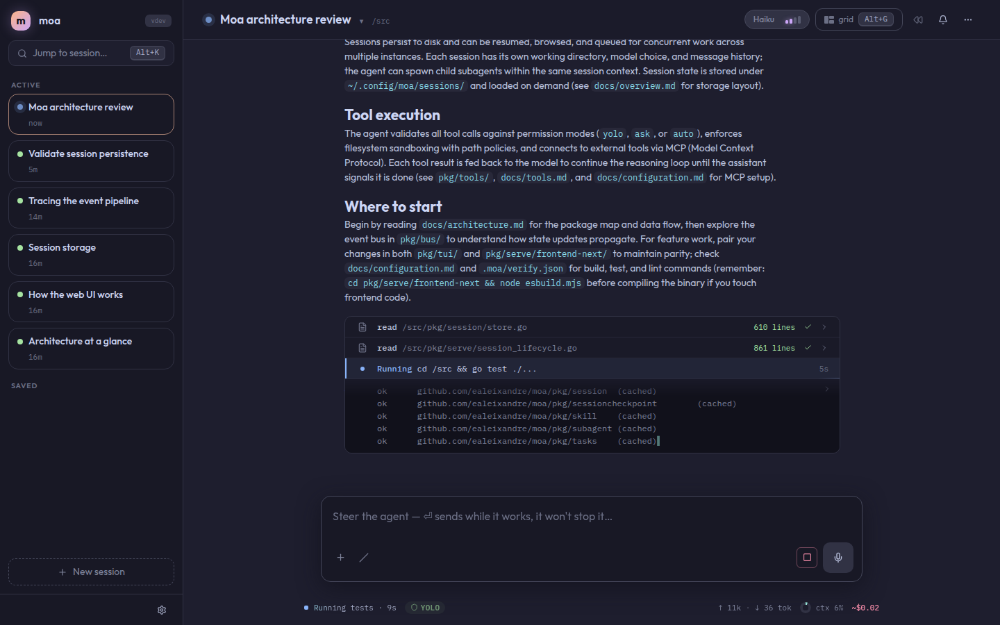
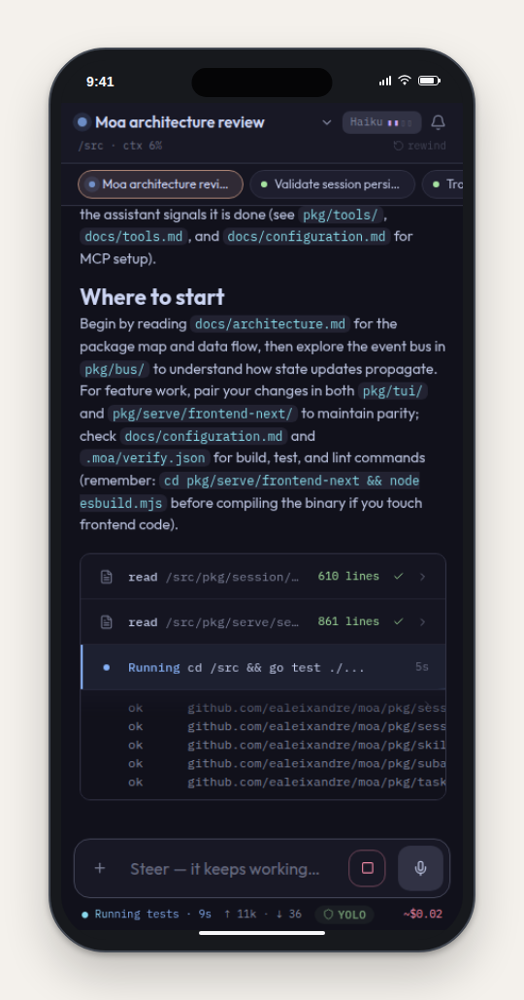
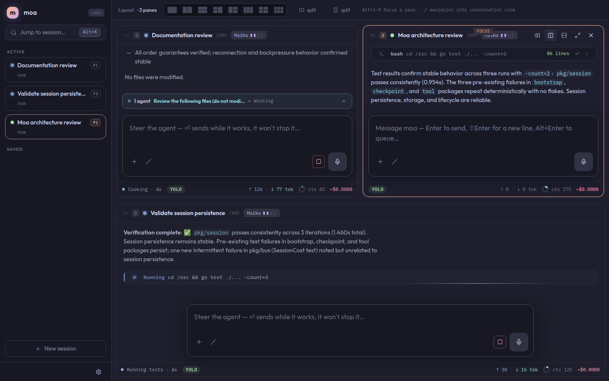

<p align="center">
  
</p>

<h1 align="center">Moa</h1>

<p align="center">
  <strong>A self-hosted coding agent for the machine where your code lives — usable from desktop or phone.</strong>
</p>

<p align="center">
  <a href="#quick-start">Quick start</a> ·
  <a href="#security">Security</a> ·
  <a href="#documentation">Documentation</a>
</p>

> **“I did not build Moa to replace my computer. I built it because I could not always be at one.”**

At some point my life stopped giving me long stretches at a desk. Some days I had two hours at the computer; some days, one. I tried the existing answers — remote-control apps for coding agents got me halfway, but sooner or later something always forced me back to the physical machine: a stuck process, an environment to bring up, a result I could not see from my phone.

So I built Moa. The agent lives on the machine where my code, repositories, and tools already are, and I steer it from wherever I am. In a normal day it works in a Git worktree, brings up the project's Docker environment, runs the builds and tests, drives the app with Playwright and sends me screenshots as evidence, or exposes a port so I can try the result myself. When a 500 shows up in production, it investigates and we fix it together — from my phone.

As I write this, I have not opened my laptop in three weeks, and I am putting in full days of real development work.

The point is not to turn a phone into a tiny laptop. It is to stay in the loop while real development work happens on the machine built for it.

Moa separates **where the agent works** from **where you steer it**. Run it on a workstation or development server that already has your repositories and toolchain, then open the same workspace in a browser. Start a task at your desk, check its progress from your phone, answer a permission request, or redirect the session without moving the project to another machine.

<p align="center">
  
  <br/>
  <em>An active coding session on desktop: conversation, tool work, and results stay together.</em>
</p>

## The development machine stays put. You do not have to.

A phone is not the best place to edit a codebase line by line. It is a very good place to
stay in the loop.

Moa's mobile interface lets you return to the same server-side sessions, see what the agent
is doing, answer questions or permission prompts, send new direction, and stop or resume work.
The repository, dependencies, credentials, and running processes remain on the development
machine.

<p align="center">
  
  <br/>
  <em>The same running session on an iPhone — progress and decisions without reopening the laptop.</em>
</p>

## See the work, not just a chat transcript

Agent work quickly becomes more than one stream of messages. Moa can keep several sessions
open in a pane grid, use a different model for each one, and show tool activity, delegated
agents, usage, and attention state alongside the conversation.

The goal is not to make you watch more logs. It is to make it obvious what is running, what
finished, and what needs you.

<p align="center">
  
  <br/>
  <em>Parallel sessions with live telemetry and delegated work visible in the Live Dock.</em>
</p>

## Why self-host the agent?

Moa runs on infrastructure you control rather than uploading your repository to a
Moa-operated service.

- **Use the environment you already have.** The agent works with the repository, shell,
  compilers, containers, and project tools installed on the host.
- **Choose your own access boundary.** Keep it on localhost, reach it through a private
  network such as Tailscale, or place it behind your own authenticated reverse proxy.
- **Keep operational state on your machine.** Session history, configuration, credentials,
  and project memory are stored by your Moa installation.
- **Use the provider you choose.** Moa talks to Anthropic or OpenAI from your machine and
  does not add a separate hosted agent service in between.

Self-hosted does **not** mean offline: prompts, selected code or file content, and tool results
needed by the model are sent to the provider you configure. Review that provider's data
policies and use Moa's permission and path controls for the level of access you want.

## Built for a real development loop

- **Work with the whole project.** Moa can inspect and edit files, run shell commands,
  execute tests, search the repository, and use the development tools available on the host.
- **Stay in control.** Choose `ask`, AI-evaluated `auto`, or permissive `yolo` permissions,
  combine them with path scoping, and use checkpoints, budgets, and run limits.
- **Delegate and parallelize.** Run multiple sessions or let an agent spawn synchronous or
  asynchronous subagents whose activity can be inspected live.
- **Exchange real artifacts.** Attach images, PDFs, source files, and other inputs; the agent
  can return downloadable files, rich Markdown, images, and sandboxed HTML previews.
- **Bring your own workflow.** Add MCP servers, custom script tools, verification commands,
  reusable skills, and project instructions through `AGENTS.md`.

For the complete capability reference, see the
[Overview](docs/overview.md), [Tools](docs/tools.md), and
[Configuration](docs/configuration.md) documentation.

## Use the provider you already have

Moa supports Anthropic and OpenAI.

You can authenticate with a **Claude Pro or Max** or **ChatGPT Plus/Pro** subscription through
OAuth, without configuring a separate API key for the main agent. Anthropic and OpenAI API keys
are supported as well. Model availability and usage limits remain those of the provider account
you use.

## Quick start

Prebuilt binaries are available from
[GitHub Releases](https://github.com/ealeixandre/moa/releases/latest). To build from source,
you need Go 1.25+ and Node.js/npm for the embedded web frontends:

```bash
git clone https://github.com/ealeixandre/moa.git
cd moa

make fe-install fe-next-install
make build
# → ./bin/moa
```

Authenticate with an existing subscription:

```bash
./bin/moa --login anthropic   # Claude Pro/Max OAuth
./bin/moa --login openai      # ChatGPT Plus/Pro OAuth, or choose an API key
```

Or provide an API key directly:

```bash
export ANTHROPIC_API_KEY="..."
# or:
export OPENAI_API_KEY="..."
```

Start the web UI:

```bash
./bin/moa serve
# → http://127.0.0.1:8080
```

To reach Moa from a phone, put the server and phone on the same private network. For example,
with Tailscale:

```bash
export MOA_SERVE_TOKEN="<a-long-random-secret>"
./bin/moa serve --host 0.0.0.0
```

Open the server's Tailscale IP from the phone. See the
[Web UI security guide](docs/serve.md#security) for the token URL, MagicDNS
`--allowed-hosts`, TLS, and reverse-proxy guidance.

For complete installation, authentication, and first-run instructions, see the
[Quickstart](docs/quickstart.md).

## Security

`moa serve` binds to `127.0.0.1` by default, but it does **not** enable authentication by
default. Anyone who can reach an unauthenticated Serve port can control its agents.

For remote access:

1. Prefer localhost, Tailscale, or another private network boundary.
2. Set `--token` or `MOA_SERVE_TOKEN` in addition to that boundary.
3. Configure `--allowed-hosts` when accessing Moa through a hostname.
4. Use TLS when the deployment or paired-device flow requires it.
5. Do not expose an unauthenticated Moa port to a network.

The token is defense in depth, not a replacement for an appropriate network boundary. Read
[the full security documentation](docs/serve.md#security) before exposing Serve beyond localhost.

## Prefer the terminal?

The browser, TUI, and headless CLI share the same agent core and session model.

```bash
./bin/moa                       # interactive TUI
./bin/moa -p "fix the tests"    # one-shot, headless
```

See [TUI Usage](docs/tui.md) and the [CLI Reference](docs/cli.md).

## Documentation

For installation details, configuration, tool behavior, limits, and security guidance, see the
full documentation in `docs/`:

| Document | Reference |
|---|---|
| [Overview](docs/overview.md) | Capabilities, interfaces, runtime flow, and storage |
| [Quickstart](docs/quickstart.md) | Requirements, build, authentication, and first run |
| [Web UI](docs/serve.md) | Serve, panes, mobile use, attachments, voice, and security |
| [CLI Reference](docs/cli.md) | Commands, flags, model aliases, and examples |
| [TUI Usage](docs/tui.md) | Slash commands, keybindings, and interactive workflows |
| [Configuration](docs/configuration.md) | Config files, permissions, sandboxing, models, and MCP |
| [Tools](docs/tools.md) | Built-in tools, custom tools, subagents, and verification |
| [Architecture](docs/architecture.md) | Package map, event bus, and runtime design |
| [Releases](docs/releases.md) | Versioning, release process, and update checks |

## License

Moa is available under the [MIT License](LICENSE).
