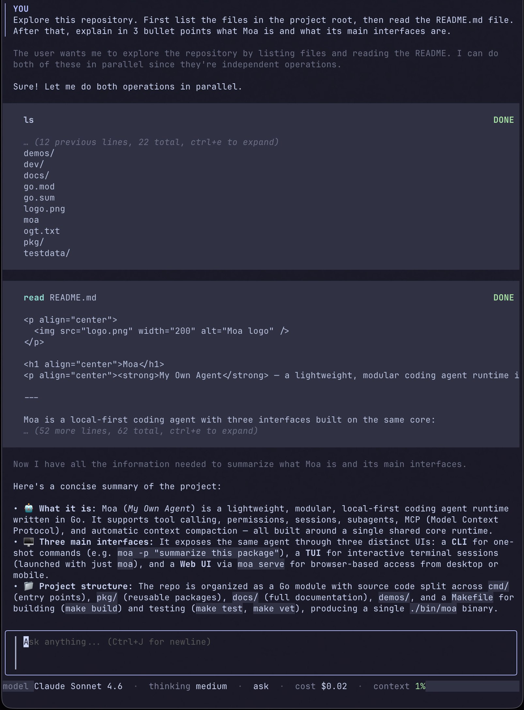

<p align="center">
  
</p>

<h1 align="center">Moa</h1>
<p align="center"><strong>My Own Agent</strong> — a lightweight coding agent runtime in Go.</p>

---

Moa is a local-first coding agent with three interfaces on the same core:

- **TUI** for interactive terminal sessions
- **Web UI** via `moa serve` for desktop and mobile
- **CLI** for one-shot scripts and pipelines

It supports tool calling, permissions, sessions, plan mode, subagents, MCP, memory, budget limits, voice input, and automatic context compaction.

<p align="center">
  
</p>

<p align="center">
  
</p>

## Quick start

```bash
make build              # → ./bin/moa
export ANTHROPIC_API_KEY="..."  # or OPENAI_API_KEY

moa                     # interactive TUI
moa -p "fix the tests"  # one-shot
moa serve               # web UI at http://127.0.0.1:8080
```

## Documentation

| Doc | What it covers |
|-----|---------------|
| [Overview](docs/overview.md) | What Moa is, capabilities, how it works |
| [Quickstart](docs/quickstart.md) | Install, authenticate, first run |
| [CLI Reference](docs/cli.md) | Flags, model aliases, examples |
| [TUI Usage](docs/tui.md) | Slash commands, keybindings, plan mode |
| [Web UI](docs/serve.md) | `moa serve`, panes, voice, keyboard shortcuts |
| [Configuration](docs/configuration.md) | Config files, fields, permissions, MCP |
| [Tools](docs/tools.md) | Built-in tools, custom script tools, subagents |
| [Architecture](docs/architecture.md) | Package map, event bus, runtime model |

## Build & test

```bash
make build        # compile binary
make test         # run all tests
make serve        # build + start web UI
```
