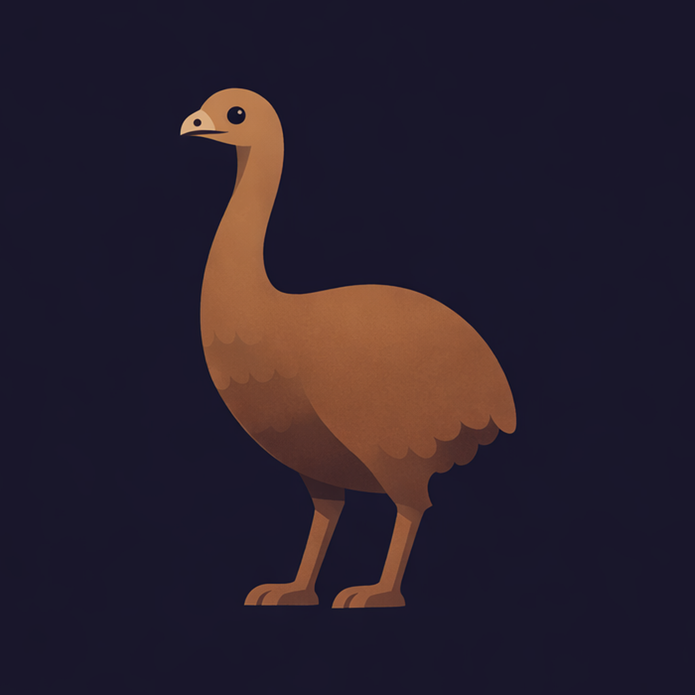

<p align="center">
  
</p>

<h1 align="center">Moa</h1>
<p align="center"><strong>My Own Agent</strong> — a minimal, extensible coding agent in Go.</p>

---

Moa is a local-first coding agent runtime with a terminal UI, headless CLI mode, tool calling, permissions, sessions, subagents, and context compaction.

## Documentation

- [Overview](docs/overview.md)
- [Quickstart](docs/quickstart.md)
- [CLI Reference](docs/cli.md)
- [TUI Usage](docs/tui.md)
- [Configuration](docs/configuration.md)
- [Tools](docs/tools.md)
- [Architecture](docs/architecture.md)

## Build

```bash
make build
# -> ./bin/agent
```

## Test

```bash
make test
make vet
```

## Roadmap

See [`ROADMAP.md`](./ROADMAP.md).
