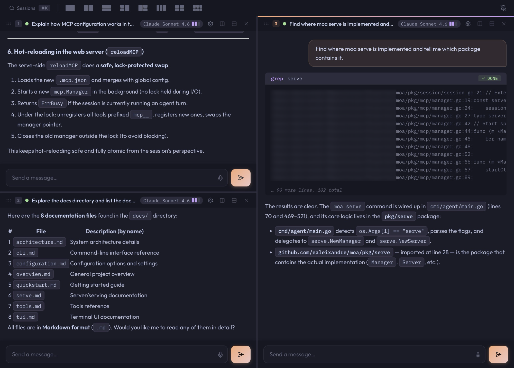
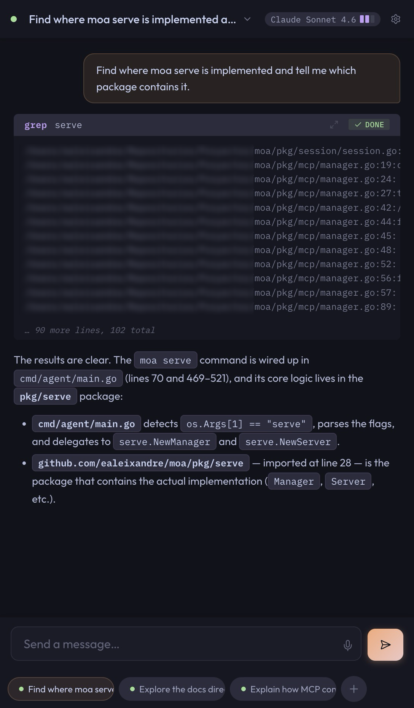

# Serve / Web UI

`moa serve` starts a small HTTP/WebSocket server and exposes Moa in the browser.

It is useful when you want to:

- continue sessions from another device
- use Moa from mobile more comfortably than a raw terminal
- keep multiple browser sessions open at once

## Start it

```bash
moa serve
```

Default address:

```text
http://127.0.0.1:8080
```

Expose it on your network:

```bash
moa serve --host 0.0.0.0 --port 8080
```

## What it supports today

- multiple sessions
- per-session working directory
- session persistence and resume
- streaming output over WebSocket
- permission prompts
- cancel running sessions
- subagents
- MCP loading per session
- model and thinking reconfiguration
- command palette for session switching and creation
- multi-pane tiled layouts
- keyboard navigation between panes
- voice input in the focused pane

## Voice input

Voice input is available in the web UI when transcription is configured:

```bash
moa --login openai-transcribe
```

It inserts transcribed text into the currently focused input.

Browser microphone access usually requires HTTPS, so voice input works best on localhost, Tailscale, or behind your own HTTPS setup.

## Keyboard-first workflow

`moa serve` is designed to work well from the keyboard:

- `⌘K` on Mac / `Alt+K` elsewhere — open the session palette
- `⌘1..9` / `Alt+1..9` — focus panes by number
- `⌘.` / `Alt+.` — toggle voice input for the focused pane
- `Esc` — close the palette or go back

On non-Mac platforms, Moa uses `Alt` instead of `Ctrl` to avoid common browser shortcut conflicts.

## Session palette

The session palette is the main navigation surface in `moa serve`.

It lets you:

- search sessions
- jump to open sessions
- resume saved sessions
- create a new session
- choose a recent project or type a custom path

## Panes and layouts

On desktop, `moa serve` supports multi-pane layouts for working on several sessions at once.

You can:

- split panes horizontally or vertically
- switch focus by keyboard
- move sessions between panes
- apply layout presets from the top bar

## Security note

`moa serve` does **not** include built-in authentication.

Safe default use cases:

- localhost
- Tailscale or another private network
- behind your own reverse proxy with auth

## Static assets

By default, the web UI is served from embedded assets.

For frontend development, you can override the static directory:

```bash
MOA_SERVE_STATIC_DIR=/path/to/static moa serve
```

## Desktop



## Mobile


